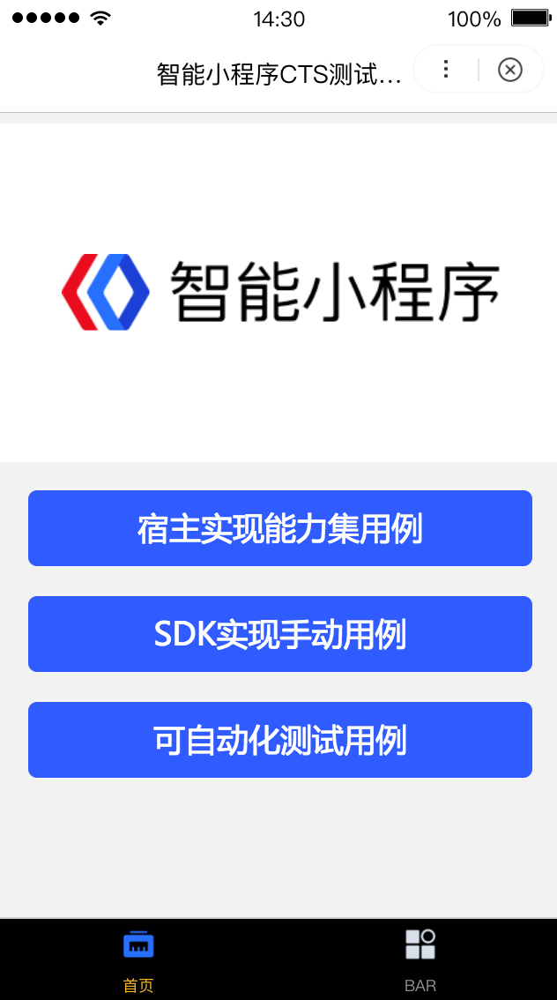
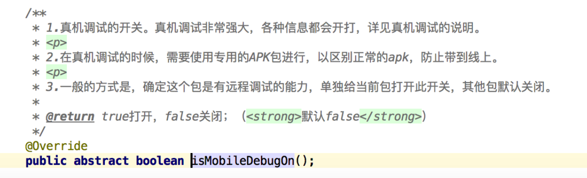
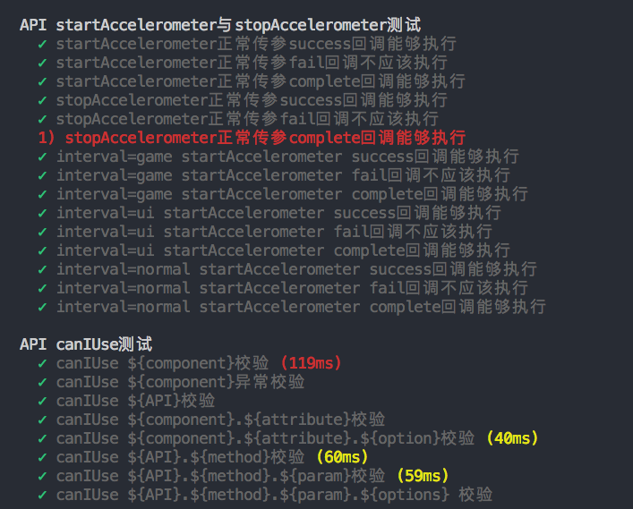
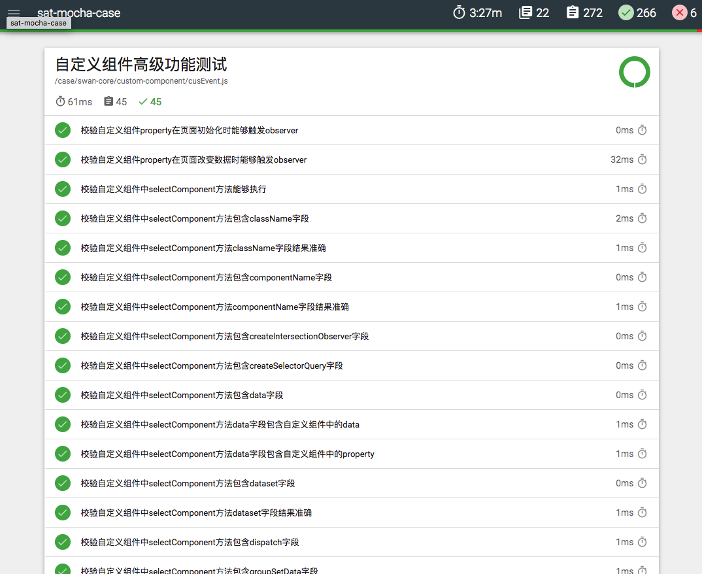
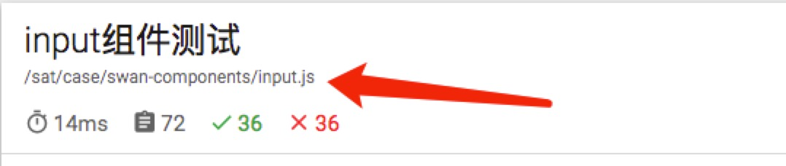
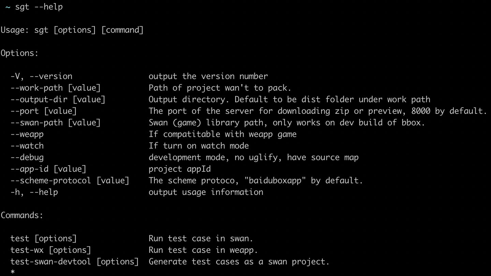

# 什么是CTS测试
宿主在接入智能小程序SDK后，部分端能力的实现由宿主侧开发实现。上线前需要通过CTS验证，可以保证对应底层能力实现符合预期，进而保证在百度App上的小程序也能够同样运行在宿主的运行环境上。

# 需要实现的入口
需要实现可以对外的scheme调起协议，格式如下：宿主协议头://swan/appid。例如（baiduboxapp://swan/PccCNGKCYawUcfCxivhfmTEuCICGK0IX_trial）
**需要可以通过abd命令调起cts小程序（adb shell am start -d 调起协议），请上线前测试该cts测试通路是否通畅**

# 智能小程序调试工具
智能小程序调试工具提供开启cts测试中需要打开的各种测试开关，包括（替换swan core,game core等功能），具体appkey和二维码可以在开源联盟平台查阅


# 小程序CTS测试

##CTS智能小程序
在您的宿主App上通过扫码或者adb等方式启动并加载CTS智能小程序。根据页面提示进入您需要校验的能力页面，根据页面提示完成相关操作查看运行结果。

##自动化测试用例
通过在您的MAC主机上安装对应环境，运行自动化脚本化脚本。需要说明的是，自动化测试用例当前支持的能力覆盖度约70%，即使您选择自动化用例，也同样有一小部分需要用小程序方式进行校验（当前只支持Android，iOS开发中）

##使用推荐

当宿主首次接入时，建议通过CTS智能小程序通过页面进行功能联调&自测，验证通过后再通过自动化测试对整体能力进行回归。

##CTS智能小程序说明
通过在宿主App上利用调起协议或扫码打开CTS智能小程序，根据页面提示check页面效果是否符合预期。CTS通过在宿主App上利用调起协议或扫码打开CTS智能小程序，根据页面提示check页面效果是否符合预期。

###CTS智能小程序AppKey
PccCNGKCYawUcfCxivhfmTEuCICGK0IX_trial

###CTS智能小程序调起协议
宿主协议头://swan/PccCNGKCYawUcfCxivhfmTEuCICGK0IX_trial

### 打开方式

 - 【Android】通过命令 adb shell am start -d 调起协议，打开对应小程序
 - 【iOS】将调起协议复制到Safari浏览器中，根据提示点击确定调起CTSafari浏览器中，根据提示点击确定调起CTS智能小程序


#CTS智能小程序效果图

CTS智能小程序共有如下3个Button：

###宿主实现能力集用例
这部分对应由宿主App自己实现的对应功能，宿主同学需要重点关注。无论对应用例是否支持自动化，相关API能力都在这里列出；
###SDK实现手动用例
这部分内容由SDK实现，由于这部分内容涉及音视频等相关内容无法被自动化校验，因此用例需要手动执行。宿主同学需要按照页面操作验证，保证宿主没有影响到原有SDK相关功能；
###可自动化测试用例
这部分内容由SDK实现，自动化用例中已对对应功能进行验证。如果您已运行sat自动化用例(Android自动化已完成，iOS自动化加紧开发中)，您就无需在关注这里面的内容。

#智能小程序自动化脚本运行方法说明

### 【 宿主App相关】能够支持CTS自动化测试用例的宿主App需要开启真机调试开关

 - 列表项需要开启真机调试功能，AbsSwanAppConfig.java文件中isMobileDebugOn()开关

	
 - 确认开启标识：在通过adb连接电脑的手机上打开小程序，电脑端开启Chrome浏览器输入chrome://inspect，宿主包名下对应小程序页面能够被inspect。。
###【运行手机相关】运行CTS自动化测试用例的手机需要如下几步操作
 -  手机打开“开发者选项”与电脑进行连接，通过adb devices与能够看到已与电脑相连的设备列表
 - 手机开启“模拟点击”功能，以便CTS自动化测试能够对您的手机进行操作点击
 - 手机需要打开宿主App访问本地文件的权限
 - 宿主App需要在登录状态下进行校验
 - CTS智能小程序在宿主App的全部权限（如摄像头权限、地理位置权限）都需要允许使用

###【电脑环境相关】电脑上的bat-agent安装与启动
 - 安装运行所需相关全局变量（bat-agent、mocha、mochawesome）
	 - 	指令：npm install -g bat-agent
	 - 指令：npm install -g mocha
	 - 	指令：npm install -g mochawesome
	 - 	注：如果您的电脑之前没有安装过node或者npm等相关内容，运行这些命令无法成功时，请百度查找相关报错内容进行对应内容的修复。
 -  确认手机与电脑已通过adb连接成功
	 - 	命令：adb devices；能够看到已连接手机的deviceID
 -  启动bat-agent
	 - 	MAC设备启动命令：bat
	 - Win设备启动方法，进入bat-agent安装目录，执行npm run start
	 - 执行完毕后，展示【BAT Engine start at port of 8090】表示环境搭建完成。
 
###自动化测试工程的启动
 -  安装测试用例依赖
	 - 进入用例cts目录中，安装相关依赖
		 - 指令：npm install
 -  确认注册宿主协议头与包名对应关系
	 - 每个宿主需要在代码中维护协议头与包名的映射关系，以便自动化测试能够进行元素定位。
		 - 首次接入时请确认satAutoCase/util/property.js中的“SCHEME_HEAD”变量已维护您宿主的schemeHead与包名映射，数据来源取自宿主平台；如有异常或变更请在宿主平台进行设置或进行反馈
 -  修改宿主运行环境配置
	 - 修改satAutoCase/env.js文件中的“APP”变量为宿主的schemeHead，已调起对应宿主App
	 - 	修改satAutoCase/env.js文件中的“BAIDU_COMPANY”布尔变量，设置为false中将会过滤掉用例中的私有API参数校验
	 - 	修改satAutoCase/env.js文件中的“API_LIST”中可选API能力集是否支持，设置为false的API对应用例将在执行时被跳过
 -  配置宿主实现Android相关控件的元素定位
	 - 在由宿主开发实现的相关模块上（如图片查看器等），元素的对应xpath由宿主自行实现。自动化用例已经前置填好操作步骤，宿主的控件定位需要通过UIAutomatorViewer工具进行查看，并配置在satAutoCase/util/naElement.js文件中。
	 - 当前需要宿主自行配置的客户端元素包括：
		 - 图片查看器相关
			 - CHOOSEIMAGE_IMAGE,可以选中图片选择器里一张图片的元素定位
			 - 	CHOOSEIMAGE_CONFIRM_BUTTON,图片选择器的“确定”按钮元素定位
			 - 	CHOOSEIMAGE_CANCEL_BUTTON,图片选择器的“取消”按钮元素定位
		 - 地理位置（openLocation与chooseLocation）相关
			- OPENLOCATION_BACK_BUTTON,openLocation的“返回”按钮元素定位
			- CHOOSELOCATION_CONFIRM_BUTTON, chooseLocation的“确定”按钮元素定位
			- CHOOSELOCATION_CANCEL_BUTTON, chooseLocation的“取消”按钮元素定位
	
		 - 发票抬头和收货地址相关
			- CHOOSEINVOICETITLE_CONFIRM_BUTTON, chooseInvoiceTtile的“确定”按钮元素定
			- CHOOSEINVOICETITLE_CANCEL_BUTTON, chooseInvoiceTtile的“取消”按钮元素定
			- CHOOSEADDRESS_CONFIRM_BUTTON, chooseAddress的“确定”按钮元素定
			- CHOOSEADDRESS_CANCEL_BUTTON, chooseAddress的“取消”按钮元素定位
 - 确认环境已经调通的标志
	 - 【mocha -t 180000 satAutoCase/case/swan-api/showModal.js 】，执行后对应case全部通过，标志除宿主自实现Android控件元素定位的其他环境已全部通过
	 - 	【mocha -t 180000 satAutoCase/case/swan-api/chooseImage.js 】，执行后对应case全部通过，标志宿主自实现Android控件元素定位（图片查看器）也已全部通过，可以批量运行CTS自动化测试了（注：chooseImage的图片选择器需要宿主自己实现）
 
 - CTS用例批量运行方法
	 - MAC运行指令：npm run cts
	 - Windows运行指令：npm run ctswin
 - 本环节大约持续15-30分钟，运行完后会整体产出测试报告，运行时终端展示如下图：


 - 测试报告查看
	 - case完成后，测试报告会产生在case目录的mochawesome-report文件夹下，效果如下图
	 
		 - 注：由于批量运行case数量1300+，运行过程中可能会存在少量case误报的问题。可如下图获取
	 - 失败case运行路径，通过指令【mocha -t 180000 ${path} 】来进行case的单步调试，确定是否存在问题
		
####联系方式
丛凤翔 （18611324798）


# 小游戏CTS测试

# 自动化测试用例

## 宿主测试环境

使用debug版本的宿主app

提供scheme调起小游戏&小程序入口

## 安装CTS测试环境

### 根据操作系统版本下载对应的sgt版本

| 系统    | sgt版本     |
| ------- | ----------- |
| linux   | sgt-linux   |
| mac     | sgt-macos   |
| windows | sgt-win.exe |

修改sgt权限，保证sgt具有可执行权限。

### 配置全局环境变量sgt

环境变量配置方法参见 [006tKfTcly1g1bnsfo60pj31400mik3y.png](./image/8429f16671614e76ddea76e770458d4bd4fb066a.png)

### 检查是否安装成功

```shell
sgt --help
```

预期输出



## 运行测试用例

### 选择测试用例版本

```powershell
# 在swan-game-cts中根据集成SDK版本选择用例版本
# sdk与swan-game版本映射关系
# 2.5.0 <———>1.7.X
# 2.5.3 <———>1.7.X
# 2.6.0 <———>1.8.X
# 2.7.0 <———>1.9.X
cd swan-game-cts
git checkout release-X.X.X
```

### 设置debug配置项

配置appKey

```powershell
# 在swan-game-cts 工程下根目录创建swan-appkey文件
cd swan-game-cts
touch swan-appkey
# 将小游戏的appkey写入swan-appkey文件
echo "kYgTkh67HPwvWRl12enuGrnSrpBQL6Up">>swan-appkey
```

使用开源宿主调试工具配置debugConfig

](./image/171ee9bcef23df961b23496d1157b73a9c1a1641.png)

appKey: QVgDrpPPg8G3jzwm8NafW3vxWnR4CN4d_dev406

开启「请求不校验https」、「域名校验豁免」、「小游戏支持本地包调起」三个开关

设置host为本地ip地址、port为"8123"

### 执行测试用例

```powershell
cd swan-game-cts
# 「sgt」为配置好的全局环境变量
# 「协议头」由宿主自定义
# 执行IO类的case(执行 src/autoCaseIndex.js 中的所有测试用例)
sgt test --scheme-protocol 协议头
# 执行UI类的case(执行 src/manualCaseIndex.js 中的所有测试用例)
sgt test --entry manual --scheme-protocol 协议头
# 执行广告的case(执行 src/adCaseIndex.js 中的所有测试用例)
sgt test --entry ad --scheme-protocol 协议头
```


### 测试结果页介绍

](./image/4408ac6868bb2ddf3270c24c8673b639056ef7f4.png)

## 常见问题

1. 提示检查https

   没有开启「请求不校验https」、「域名校验豁免」

2. 运行sgt test 报错命令不存在

​       sgt没有可执行权限，修改macos-sgt权限，使其具有可执行权限

​       sgt全局环境变量未生效，检查环境变量配置

3. 运行sgt test报错

​       根据报错信息排查

# 手动CTS测试

部分API无法通过自动化测试覆盖，因此提供手动测试用例

## 使用方法

扫二维码打开百度小游戏CTS测试用例

](./image/976e9bd7f222a6c07d56c8cf993e48d06ab57cfb.png)

appKey: kYgTkh67HPwvWRl12enuGrnSrpBQL6Up_dev8010

## 测试建议

各版本SDK均不需关注

* 手动测试用例->开放接口->客服消息

SDK版本低于2.6.0不需关注

* 手动测试用例->设备->转屏

* 手动测试用例->系统->生命周期->swan.reload

* 手动测试用例->界面->添加到桌面引导


接口人：王文翰（13998852667）（13998852667）

