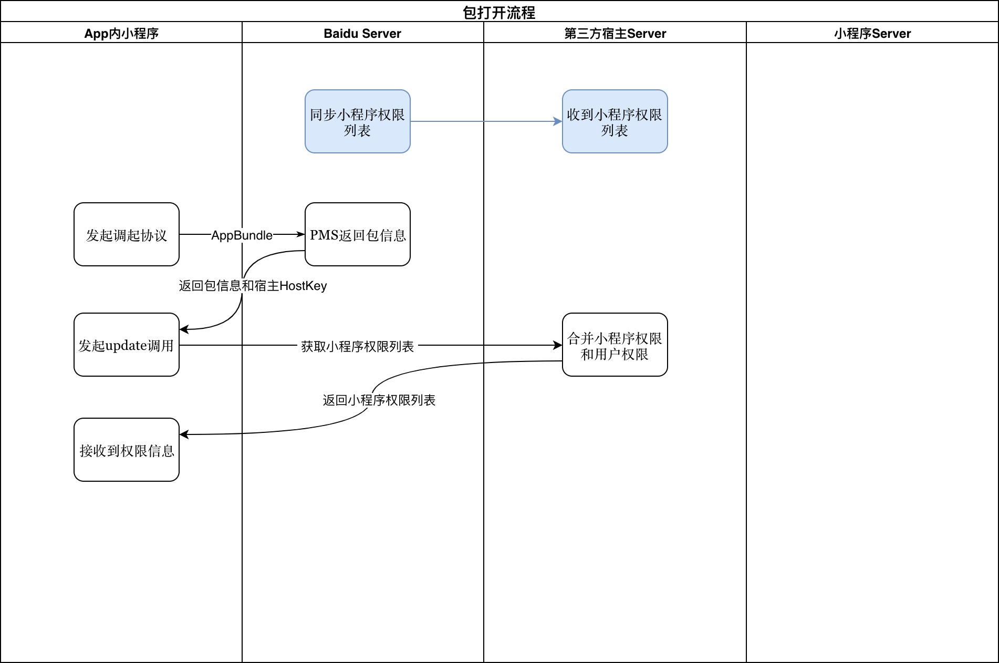
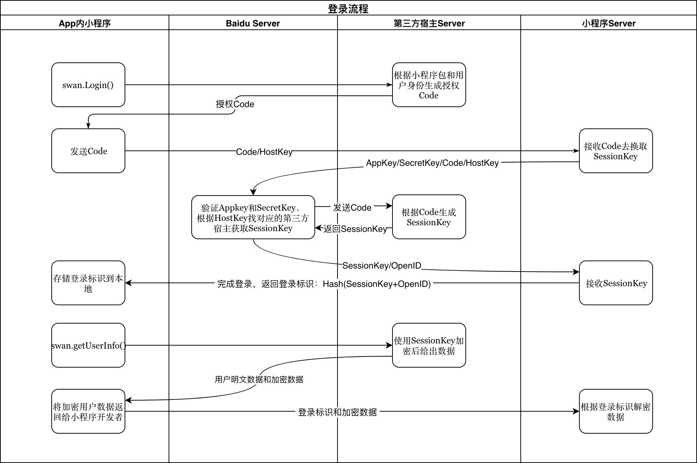

# 外部接入方服务端实现建议 

本文档对小程序开源服务端接口进行了整体梳理，给出百度智能小程序开源接入方宿主标准实现建议。第三方开源接入方可以参考本文档实现接入小程序的服务端逻辑。

先简单介绍服务端视角的小程序运行机制:




开源接入不关心接入宿主的编码语言、请求参数等细节，只关心返回的数据格式符合客户端解析要求。返回数据的格式统一为：

```
{
    "errno": "0",       // 错误码, string, "0" 表示成功
    "errmsg": "",       // 错误信息，string
    "request_id": "123456789", // 请求ID 
    "data": { }         // 具体的业务数据
}
```

## OAuth相关


OAuth相关设计图:




#### 1 用户授权查询

> 本接口会在小程序启动和请求授权数据时调用。

返回格式要求： 

```
{
    "errno": "0",
    "errmsg": "",
    "request_id": "123456789",
    "data": {
        "accredit": {
            "version": "version_002", //这是一个优化，当本地的version == 服务端最新数据的version 时， data不返回，客户端使用本地数据
            "errno": "0", ,
            "data": {
                "list": {       // 权限列表
                    "snsapi_userinfo": {
                        // 字段参看 本文档 获取用户相关数据 返回数据 的 data.scope
                    }
                }
            }
        }
    }
}
```


#### 2 用户授权并返回开放数据

> 用户同意或者拒绝授权时调用的服务端接口。

返回格式要求： 

```
 {
    "errmsg": "succ",
    "errno": "0",
    "request_id": "3465815568",
    "data": {
        "opendata": {
            // 字段参看 本文档 获取用户相关数据 返回数据 的 data.opendata
        }
    }
}
 
```

#### 3 用户授权

返回格式要求： 

```
{
    "errno": "0",
    "errmsg": "succ",
    "request_id": "3465815568",
    "data": {
    }
}
```


#### 4 登录

> 登录接口对应小程序能力 `swan.login()`。

接口返回格式：

```
{
    "errno": "0", 
    "request_id": "123456789",
    "errmsg": "",
    "data": {
        "code": "xxxxxxx", //登陆状态，code不为空，非登陆状态下code为空。
    }
}
```

#### 5 check session

> check session 对应小程序能力 `swan.checkSession()`

接口返回格式：

```
{
    "errno": "0",
    "errmsg": "",
    "request_id": "123456789",
    "data": {
        "result": true|false 服务端的session key 是否有效
    }
}
```


#### 6 获取用户相关数据

> 获取用户相关数据对应小程序能力 `swan.getUserInfo()`, `获取手机号组件`。

接口返回格式：

```
{
    "errno": "0",
    "errmsg": "",
    "request_id": 123456789,
    "data": {
        "scope": {
            "id": "userinfo",
            "permit": "true",       // 表示用户是否允许，取值 {"true", "false"}
            "forbidden": "false",   // 表示是否被禁用
            "type": "1",            // 1用户相关， 2设备相关。用户相关可能调起登录
            "grade": "1",           // 客户端权限分级{1:单次授权,2:终身次授权,3:无需授权}
            "need_apply": "0",      //预留字段，10.5永远是"0"
            "name": "获取你的用户信息(昵称、头像等)", //用户弹框的权限描述
            "short_name": "用户信息"    //用户设置页面显示短名称
            "description": "用户弹框中的问号对应内容",
            "tip_status": "0",      //弹框控制，取值 {1:同意 0:弹框 -1:拒绝}
            "rule": [],             // 10.5.0 版本客户端暂时不支持
            "ext": {}
        }，

        // 如果scope没有对应的opendata，将为空
        // 如果用户拒绝，将为空

        // 用户信息返回数据格式 
        "opendata": {
            "userinfo": {
                "nickname": "wangtr12345",
                "headimgurl": "",
                "sex": 0
            },
            "data": "nMPU7mhq4d04un4CnjNoOdwPQUvX0+1g2OxcqbQ4akwuFkpAJnaCHuOUwtpX8lneaXWyCoDnBTDW16RXOGEpFdqmrp",
            "iv": "de0e58fa998103b5a6440w=="
        }

        // 手机号信息返回数据格式
        "opendata": {
            "encryptedData": "nMPU7mhq4d04un4CnjNoOdwPQUvX0+1g2OxcqbQ4akwuFkpAJnaCHuOUwtpX8lneaXWyCoDnBTDW16RXOGEpFdqmrp",
            "iv": "de0e58fa998103b5a6440w=="
        }

    }
}
```

