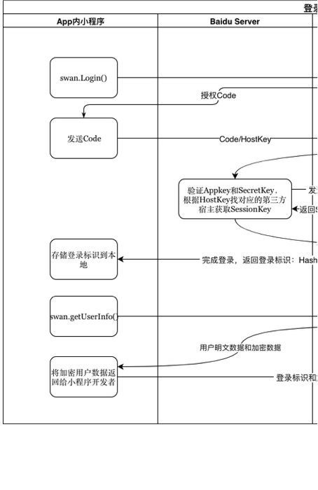
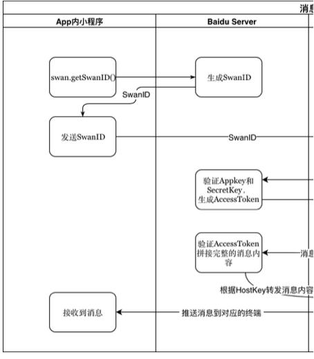

# 小程序开源服务端接口整体梳理

## C/S接口类

### 百度服务端直接提供服务:

 - 包下发 
 - 生成和获取SwanID(需要校验开发者资质，必须百度来做) 
 - AI能力:升级安全通信方案，考虑BDTLS

### 服务端出设计标准供宿主实现: 

#### 一、权限:小程序级的权限，用户授予的权限历史 

权限体系设计图:


接口

 - update:获取权限列表

```
{
    "errno": 0,
    "errmsg": "",
    "data": {
        "accredit": {
            "version": "version_002", //当作字符串比较。
            "errno": "0", //0正常 非0异常,
            "data": {
                "list": {
                    "snsapi_userinfo": {
                        "permit": "true", // 表示用户是否允许
                        "forbidden": "false", // 表示是否被禁用
                        "type": "1", // 表示scope和cuid相关还是和uid相关
                        "grade": "1", //grade:“3”, permit 永远为"true" | 客户端权限分级(1单次授权,2终身次授权,3无需授权)
                        "need_apply": "0", //预留字段，10.5永远是"0"
                        "name": "获取你的用户信息(昵称、头像等)", //用户弹框的权限描述
                        "short_name": "用户信息" //用户设置页面显示短名称
                        "description": "用户弹框中的问号对应内容",
                        "tip_status": "0", //1:同意 0:弹框 -1:拒绝
                        "rule": [], // 10.5.0 版本客户端暂时不支持
                        "ext": {}
                    }
                }
            }
        }
    }
}
```
 
 -  accredit_data:授权写入并且获取数据

```
 {
    "data": {
        "code": "history reason, never use",
        "opendata": {
            "errno": 0,
            "error": "",
            "data": "/2OTXFQ91LCYFDvRloxUd3Qn0bpFKyek+74vRATlZklJiVj8nfbI2zXWddP0iqJfjejNZjKPhuybJ+ra45L6FKshMt14yc",
            "iv ": "ec718a7b8ca261559b44fw==",
            "userinfo": {
                "nickname": "295421489",
                "headimgurl": "http://tb.himg.baidu.com/sys/portrait/item/58f2323935343231343839fb1d",
                "sex": 1,
                "shoubainickname": "295421489"
            }
        }
    },
    "errmsg": "succ",
    "errno": "0",
    "request_id": "3465815568",
    "tipmsg": ""
}
 
```
 
 - accredit_v1

```
{
    "data": {
        "code": "history reason, never use",
    },
    "errmsg": "succ",
    "errno": "0",
    "request_id": "3465815568",
    "tipmsg": ""
}
```

#### 二、OAuth相关接口 

OAuth相关设计图:



接口:

 - login

仅做登录接口

```
{
    "errno": "0", //code,opendata任意一种失败，整体认为失败。
    "request_id": "123456789",
    "errmsg": "",
    "data": {
        "code": "xxxxxxx", //登陆状态，code不为空，非登陆状态下code为空。
    }
}
```

 - checksessionkey: 校验sessionKey是否过期 
 - open/data: 获取指定权限数据

```
{
    "errno": 0,
    "errmsg": "",
    "request_id": 123456789,
    "data": {
        "scope": {
            "id": "userinfo",
            "permit": "true",
            "forbidden": "false",
            "type": "1", //type: 1用户相关， 2设备相关 "grade": "1",//grade:“3”, permit 永远为"true" "need_apply": "0",
            "name": "使用WebView框架",
            "short_name": "" //用户设置页面显示短名称 "description": "说明为何需要使用WebView框架", "tip_status":"0",//1:同意 0:弹框 -1:拒绝 "rule": ["baidu.com", "iqiyi.com"]， "ext":[]
        }，
        "opendata": { //opendata key存在，直接可以返回给开发者，相反opendata key不存在，获取用户信息失败。
            "userinfo": {
                "nickname": "wangtr12345",
                "headimgurl": "",
                "sex": 0
            },
            "data": "nMPU7mhq4d04un4CnjNoOdwPQUvX0+1g2OxcqbQ4akwuFkpAJnaCHuOUwtpX8lneaXWyCoDnBTDW16RXOGEpFdqmrp",
            "iv": "de0e58fa998103b5a6440w=="
        }
    }
}
```

## Server直连接口类 
### 使用百度的服务进行内部连接
 - 使用AccessToken进行消息推送等(百度服务端验证AccessToken有效性，进行消息模版拼接等) 

消息推送相关设计图:

