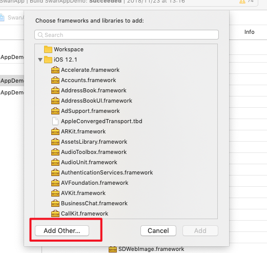

# 接入步骤
#### 一. 将所有依赖库添加到工程文件配置中。
* 1、选中target-Build Phases-点击+

* 2、在弹出的窗口中点击 Add Other

* 3、添加SwanDependLibs下的所有库


#### 二. 在appDelegate中的`didFinishLaunchingWithOptions`方法中 添加小程序初始化代码。如下：

```
/// appID为宿主app在iTunes上的appID
/// scheme是宿主app自定义的，小程序调起协议头。如：tiebaclient

[BBAMNPManager registerDispatcherAppID:@"appID" 
version:@"33" schemes:@[@"scheme"]];
        
```
#### 三. 在宿主app中，添加一个子project，并且添加`xxxxModule`文件，遵守并实现pyramid的BBPModuleProtocol协议。

```
        // .m文件中添加该宏命令
        ModuleDefine(xxxxModule类名)
```
####四. 实现BBPModuleProtocol中的`moduleRegister`方法，注册宿主实现的功能及服务。

> 注册功能及服务，以BBAMNPPlatformProtocol举例

   * 1、 `BBAMNPPlatformProtocol`是要注册的协议，所有协议由小程序提供，可见小程序代码中的adapter文件夹。
   * 2、 `XXXXXPlatformImplement`是宿主app对`BBAMNPPlatformProtocol`的实现类，其他protocol同。（小程序的功能有部分需要依赖宿主app去实现才能正常工作，具体实现列表可见其他文档，宿主app只需要创建对应的implement文件，并实现对应的协议即可）
   * 3、`BBAMNP_PLATFORM_PYRAMID_IDENTIFITER`是`BBAMNPPlatformProtocol`提供的标识常量，直接使用即可。
   
   
```
/// 注册相关逻辑modul
- (void)moduleRegister:(BBPContext *)context {
    [Pyramid registerExternService:NSProtocolFromString(@"BBAMNPPlatformProtocol") implClass:BBAMNPPlatformImplement.class identifier:BBAMNP_PLATFORM_PYRAMID_IDENTIFITER];
}

```

        

