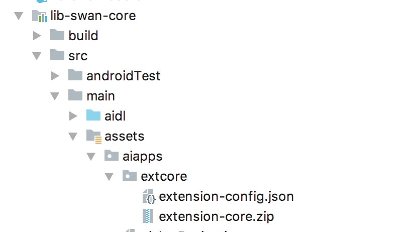
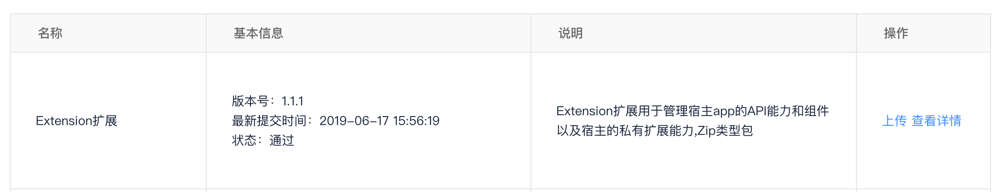
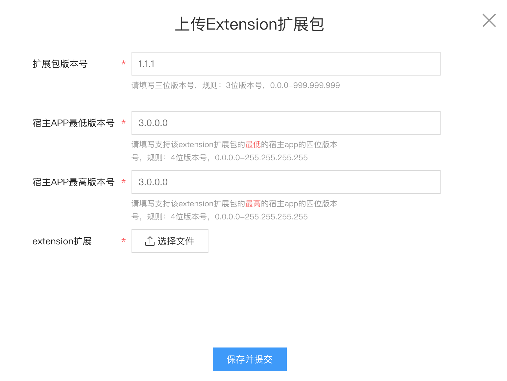

# Extersion更新指导

## 一、Extersion机制简要说明

+ 当小程序SDK自身具备的API和组件不满足宿主的需要时，宿主可以通过此机制增加自己的API和组件。
+ 这个Extersion是和宿主自身绑定的，确切的来说是和宿主自己的版本绑定的。
+ 在宿主开发完自己的Extersion能力之后，一般会将自己的extersion.js内置在自己的APP中，可正常工作。
	- extersion内置包的位置
 	
 
+ 如果这个Extersion需要更新，一般是单纯js文件更新或者修复js的bug（因为NA的代码在已经发出去的版本中无法修改）。
+ 这个时候需要将需要更新的Extersion.js 文件通过宿主平台上传上去，并指定要下发的宿主app版本，就可以将extersion.js 下发到指定的宿主app版本区间，以完成更新更新过程。

## 二、Extersion更新配置步骤说明

+ 编写好需要更新的extersion.js。
+ 登录宿主平台[宿主平台-扩展信息-上传](https://ossunion.baidu.com/opensource/home/setting.html?tab=dev-setting)。
 
 
+ 点击上传按钮，需要填一些信息，以下是具体说明，此信息比较重要，建议多Check一下。
 
 
 - 扩展包版本号： 用来标识当前extersion.js版本的（内置的extersion版本写在extersion-config.json里），此处应该做递增处理，即要比预制的版本号要大（版本范围：0.0.0 - 999.999.999）
 
 - 宿主APP最低版本号（**重要**）： 用来告诉PMS包下载系统，当前上传的这个extersion最低支持的宿主app版本是多少，后续可以修改，版本号规范见下文。
 
 - 宿主APP最高版本号（**重要**）：用来告诉PMS包下载系统，当前上传的这个extersion最高支持的宿主app版本是多少，这个最高版本号是个预估，后续可以修改和覆盖。如果extersion只支持指定的版本，就和上部的 宿主APP最低版本号 保持一致即可；如果不确定要到哪个版本，可以填写个上限或者比较大的版本。
 
 - extersion扩展 ： 上传宿主自己的extersion更新包。 

 
 
+ extersion更新和版本关系

 - extersion.js 会根据宿主的版本号和内置的版本号一起做是否下发的判断：1.首先将宿主的版本号转化成一个数字，将能下发到这个版本的所有extersion列出来（根据extersion上传的时候填写的最底支持和最高支持版本号做判断）；2.将列出的所有extersion的最高版本和内置的extersion版本作比较，内置的小则进行更新下发，否则不用更新。


+ 宿主版本号的规范

 - 每次PMS的请求都会带上宿主的版本号，具体代码在PMSImpl#getHostAppVersion。
 - 如果宿主的versionName版本号本身就是点分十进制的形式，并且不超过4分段（如 1、1.0、1.0.0、1.0.0.0 四种形式），则可以直接使用宿主自己app的versionName。获取方式如下:

	 ```
	 	PackageInfo info = context.getPackageManager().getPackageInfo(context.getPackageName(), 0);
	 	info.versionName;
	 	
	 	或
	 	SwanAppUtils.getVersionName()
	 ```
 如果宿主的版本号不符合点分十进制的形式，比如有字母（如 1.0.0.a、1.0.0-debug等），或者每段超过规定的上限（如 1.0.0.9999999）会导致PMS计算宿主版本区间无法正确比较大小，导致extersion无法下载，目前PMS做了强校验，如果版本不符合规范是直接打不开小程序的（上传extersion的页面也有强校验，无法上传）。
 这种情况下，宿主需要自己修改版本号，以满足extersion更新规范，需要修改2个地方：
 	1. PMSImpl#getHostAppVersion 返回满足规范的格式，对不符合规范的versionName按照一定规则转换，比如把原来的 1.0.0.a -> 1.0.0.10、1.0.0-debug -> 1.0.0.0等
 	2. extersion上传平台的最低版本号和最高版本号，也要按照上步的规则填写，如最低支持版本哈1.0.0.c -> 1.0.0.12、1.0.0-debug -> 1.0.0.0 最高支持版本号1.0.0.z -> 1.0.0.26、1.0.0-debug10 -> 1.0.0.10等
 	3. **需要保证PMS从getHostAppVersion中获取的版本号能和extersion上传平台上填写的版本号正常做比较运算。**


## 三、开发建议

+ 只要使用了自己的extersion，不论是不是需要更新，都在宿主平台上传一份和内置版本一样的extersion，以确认宿主的版本号符合规范。
 
