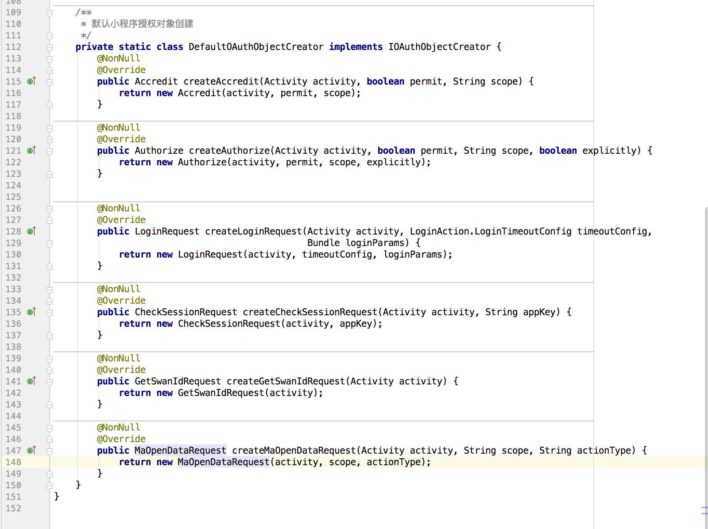
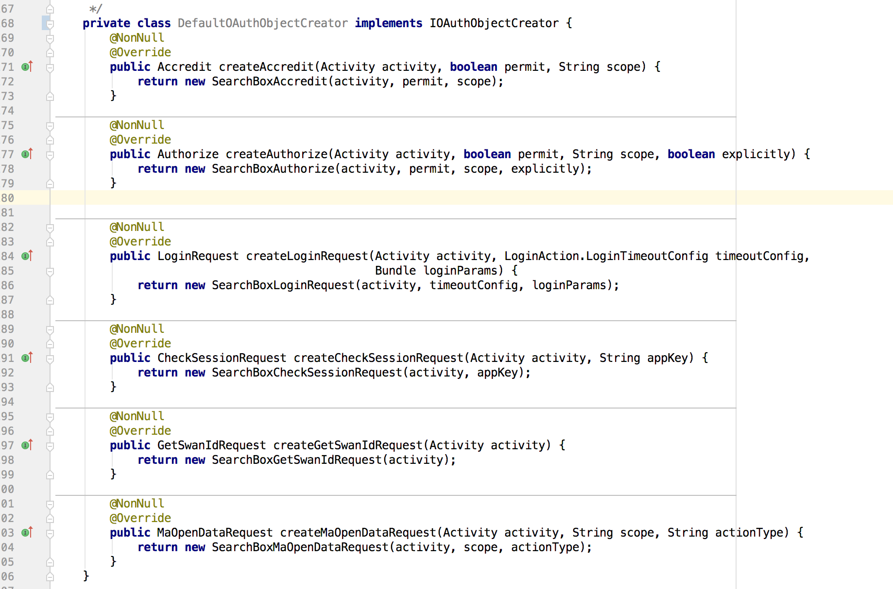

# 百度内部接入

>小程序SDK的仓库地址:http://icode.baidu.com/repos/baidu/searchbox-android/aiapps/tree/master

### 小程序结构说明

小程序由3部分构成：客户端 SDK(SwanNative)、前端 JS SDK(SwanJS)、后端服务(Server);接入 SDK 需要同时处理好这个3个部分。
+ SwanNative：主要用于对外提供系统级能力，如视频播放、直播、弹框、登录等等。
+ SwanJS：预置在客户端 SDK 内部，可以通过网络自动更新，运行于 SwanNative 的 WebView 里，提供页面和组件的展示和处理逻辑。
+ Server：SwanJs 和第三方开发的小程序包需要通过 Server 下发，登录和授权认证也需要走 Server。

### 各个库的说明

|库名|说明(从上到下)|
|--|--|
|demo | 小程序的 demo 示例，具有基本的运行小程序的能力。包含接入小程序需要做的初始化工作、小程序能力接口的实现（目前是空实现）。|
|lib-browser-base| 小程序内部浏览器框架的分类，目前为了和手百保持一致，直接扣取的代码，第三方不用关心，直接集成即可。|
|lib-event-bus | 小程序内部使用到了 RxJava 和对 RxJava 封装的 RxBus，这个库作为基础提供。|
|lib-multiprocess| 如果使用手百的 UBC（天幕）打点系统（下边的 lib-ng-aiapps-ubc lib），才需要这个库，进行跨进程打点用的。|
|lib-swan-core | 小程序的 core 代码，这个是小程序的主 lib，其他 lib 都是为他服务的。|
|lib-swan-mario|小程序内部使用的 JS 解析器是采用的 V8 引擎，此 lib 提供 V8 引擎。|
|lib-swan-pms|从 Server 拉取 SwanJs 和小程序包的下载能力，直接接入手百 Server 后台，内部直接集成即可。|
|lib-swan-menu|小程序内部使用的菜单View。|
|lib-swan-net|对okhttp的封装，更方便使用的网络库。|
|lib-swan-ubc| 小程序本身自带各种统计打点，百度内部对接 Case 直接打到百度服务器；外部对接 Case 默认不提供打点能力，属于可选。|
|lib-process-ipc|由于小程序是运行在独立进程的，需要多进程间通信，这个 lib 是用来多进程通信的。|
|lib-protobuf|lib-ng-aiapps-ubc库使用的打点统计格式。|
|lib-runtime | 小程序SDK的运行时环境，需要在app启动的时候调用，详情参考 *初始化说明*|
|lib-slide| 小程序内部使用到了侧滑返回页面的能力，这个库提供侧滑功能。|
|lib-support-empty|由于历史原因，一些代码还无法立即全部去除，为了保证编译通过，引入空实现。和业务无关，不需要关心。|
|lib-united-scheme-core|小程序内部的通信是使用Scheme协议完成的，这个是小程序内部的通信框架。|
|lib-swan-v4-fragment|下程序使用到了 fragment，但是不同版本的 v4 包有 bug，这里使用了自带的 fragment，而不是用系统的 v4 包提供的。|
|lib-websocket|小程序里的 webSocket 能力。|
|local-maven|搭建的本地 maven 仓库，用于存放 gralde 插件**后续放到中央仓库**。|

### 需要使用到的外部库

|外部库名称|版本号|
|--|--|
|com.squareup.okhttp3:okhttp:3.11.0 |okhttp3.11.0|
|com.airbnb.android:lottie:2.3.1 |lottie2.3.1|
|io.reactivex:rxjava:1.2.3|rxjava 1.2.3|
|io.reactivex:rxandroid:1.2.0|rxandroid 1.2.0|
|com.android.support:support-v4|26.1.0|
|com.android.support:appcompat-v7|26.1.0|
|com.android.support:recyclerview-v7|26.1.0|
|com.android.support:support-annotations|26.1.0|
|com.facebook.fresco:fresco|1.2.0|
|com.baidu.pyramid:pyramid-annotation|0.1.2 (小程序的金字塔注入插件)|
|com.baidu.pyramid.di|小程序的金字塔注入插件（gradle插件，编译时进行代码注入用的）配合 pyramid-annotation 使用|

> 具体配置参考 settings.gradle

### 使用到的gradle插件
+ apply plugin: 'com.baidu.pyramid.di'。
+ 具体配置参考 demo 工程 build.gradle 和 根目录下的 build.gradle。

### 接入步骤

0. SDK支持的系统版本说明[版本支持说明](../注意事项.md)
1. 将工程中的除了demo之外的所有lib，复制到自己的工程（当然，可以自己打包成aar放到工程中）
2. 配置工程，参考根目录的settigns.gradle build.gradle demo/build.gradle
3. 在app工程的的build.gradle文件中，需要使用apply plugin: 'com.baidu.pyramid.di'插件（本质是gradle打包过程的Transform机制）
4. 在app的application类中添加以下初始化代码，示例如下：

        ```
            @Override
            protected void attachBaseContext(Context base) {
                super.attachBaseContext(base);
                // 必须在attachBaseContext中初始化
                AiAppsInitHelper.initContext(this);
            }

            @Override
            public void onCreate() {
                super.onCreate();
                // 必须在attachBaseContext之后初始化
                // 如果只希望在android5.0及以上系统使用小程序，使用下列函数初始化
                // SwanAppInitHelper.initModules(this, true);
                SwanAppInitHelper.initModules(this);
            }
        ```
5. 实现lib-swan-core/com.baidu.swan.apps.ioc.interfaces包下的所有接口和抽象类（demo在com.baidu.swan.apps.demo.aiapps.impl包下，可以参考实现，百度内部接入可以参考手百的代码），结合 **接口文档实现**
6. <font color=red>百度系内部接入不需要自建服务器，使用手百的Server即可，但是需要向手百的Server端申请一些参数来区分宿主：</font>
	- 到Server申请使用的hostName（就是appName），方便Server控制小程序定点投放 & UBC打点标识 （申请之后的hostName 就是 ISwanAppConfig#getHostName() 函数的实现返回值）， 申请人找 **@付嘉兴 @陈仁松**
	- 到B端申请**协议头**和**注册上一步申请的hostName**（UA里会用到这些参数），B端交换协议直接下发宿主scheme头，申请人找 **@陈鑫**
	- 找B端申请**host_api_key**，标识开放平台的识别码，进行百度系账户的授权，申请人找 **@刘青**
7. 和手百的Server交互需要带上指定的公参才能正常访问，所有到手百Server的url需要使用URLConfig#processCommonParams 先进行处理。
8. 如果希望在小程序里添加自己的扩展能力，需要是用extersion机制，详情参考FE的文档，接口人 **@侯禹**

### 代码替换（**<font color=red>重要</font>**）
1. 由于标准的SDK不包含百度系私有参数（如stoken等），所以内部case接入需要替换掉一些类，采用内部专用的实现，才能正常和百度的Server通信，特别是账号授权相关。
2. 将以下`DefaultOAuthObjectCreator`类里的6个函数的返回对象全部替换成指定的.

替换成如下代码
 

+ `return new Accredit(activity, permit, scope);` 替换为 `return new SearchBoxAccredit(activity, permit, scope);`

+ `return new Authorize(activity, permit, scope, explicitly);` 替换为 `return new SearchBoxAuthorize(activity, permit, scope, explicitly);`

+ `return new LoginRequest(activity, timeoutConfig, loginParams);` 替换为 `return new SearchBoxLoginRequest(activity, timeoutConfig, loginParams);`

+ `return new CheckSessionRequest(activity, appKey);` 替换为 `return new SearchBoxCheckSessionRequest(activity, appKey);`

+ `return new GetSwanIdRequest(activity);` 替换为 `return new SearchBoxGetSwanIdRequest(activity);`

+ `return new MaOpenDataRequest(activity, scope, actionType);` 替换为 `return new SearchBoxMaOpenDataRequest(activity, scope, actionType);`


### 启动一个小程序
一共有2种打开方式：
* scheme 码：xxxx://swan/TZzPY8qVvX97uzIH4L2SnY0g (xxxx是接入步骤5中注册的 scheme 协议头，TZzPY8qVvX97uzIH4L2SnY0g 是要打开小程序的 id)
* url 链接（手百提供的二维码一般都是这种 url 形式）：如`https://smartapp.baidu.com/mappconsole/api/packagescheme?appKey=iNBe6qH2CklDbCNzwSAzqLpboAgB58Hn&packageId=51102`，这种实际上是需要从服务器获取一个可以打开的 scheme，和上一种形式一致。
        这两种方式都可以使用 SwanAppLaunchHelper#launch 方法打开，内部进行了统一，如逻辑不满足可自定义。
        小程序的入口就在 SwanAppLaunchHelper#launch 方法，参数就是上部所讲的2中 url 形式。

### 混淆规则
+ debug 包下不需要做任何混淆。
+ release 包的混淆规则参考 demo 工程的 demo/proguard-rules.pro 文件。

### 其他注意事项
+ 公参只用到了 cuid，判断是否登录以 cookie 的 Bduss 为准，后台拿到 Bduss 进行账号信息查询。
+ stoken 必须使用 key 是 dev 的。
+ 打开方式是一个 url 链接的，后续 Server 会修改成 302 重定向到一个 scheme 而不是返回一个包含 scheme 的 json 对象，如果打不开可以找 **@康森 @陈鑫** 确认。
+ 由于小程序是多进程架构，在跨进程启动 Activity 的时候，务必使用小程序的 context，同时 activty 不可以是 singleTask 方式，否则会有页面栈问题（从小程序进入一个 activity ，返回之后发现回到主进程了）。
+ 如果使用了手百的 UBC 打点框架，数据会打到手百的 Server，后台通过 hostName 区分，需要到 UBC 的仓库查看具体的打点信息。
+ 目前小游戏的代码和小程序的代码没做解耦，还是放在一起提供，只是小游戏的还不能使用而已，如不需要可自行删除小游戏代码（ lib-swan-core/src/main/java/com/baidu/swan/games ）目录下。

