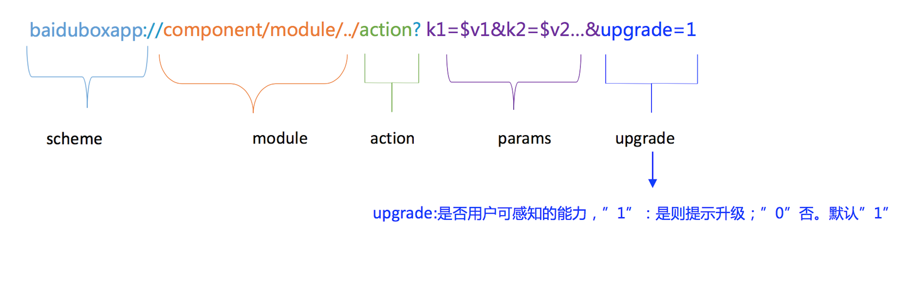

<!-- TOC -->

- [1. 端能力扩展](#1-端能力扩展)
    - [1.1. 文档版本](#11-文档版本)
    - [1.2. 功能说明](#12-功能说明)
    - [1.3. 开发指南](#13-开发指南)
        - [1.3.1. 新增端能力](#131-新增端能力)
            - [1.3.1.1. 、制定端能力调起协议](#1311-制定端能力调起协议)
                - [1.3.1.1.1. 客户端调起协议定位](#13111-客户端调起协议定位)
                - [1.3.1.1.2. 协议格式](#13112-协议格式)
                - [1.3.1.1.3. 说明：](#13113-说明)
            - [1.3.1.2. 、根据协议开发端能力类](#1312-根据协议开发端能力类)
            - [1.3.1.3. 类名](#1313-类名)
            - [1.3.1.4. 实现](#1314-实现)
        - [1.3.2. 替换已经实现的端能力](#132-替换已经实现的端能力)
            - [1.3.2.1. 开发端能力类](#1321-开发端能力类)
            - [1.3.2.2. 重定向端能力](#1322-重定向端能力)

<!-- /TOC -->

# 1. 端能力扩展

## 1.1. 文档版本

|文档版本|修改日期|修改概述|
|:--|:--|:--|
|0.8|2018-12-17|初始版本|

--------------------------
## 1.2. 功能说明
* 本文档主要介绍宿主如何新增一个端能力以及如何替换已经实现的端能力

## 1.3. 开发指南
### 1.3.1. 新增端能力
#### 1.3.1.1. 、制定端能力调起协议
##### 1.3.1.1.1. 客户端调起协议定位
* Scheme 对NA组件或模块能力的包装器，客户端以组件或模块为单位封装；H5与NA以组件或模块为单位通信

##### 1.3.1.1.2. 协议格式

```
scheme://version/component/module/../action?params=$params&callback=$callback
```


* 对于小程序框架component为固定值$swan$
* module:API为空，组件为对应的组件名

> API-获取城市省份信息

```
baiduboxapp://v22/swan/getRegionData?callback=_bdbox_js_353&upgrade=0&oauthType=swan
```
> 组件-地图组件remove端能力

```
baiduboxapp://v24/swan/map/remove?params={"mapId":"0","slaveId":"4"}&callback=_bdbox_js_186&upgrade=0
```
* version
  新增的端能力可以先写`40`
##### 1.3.1.1.3. 说明：

* 使用多级path，支持模块、子模块以及后续安全性相关扩展；
双端统一调起协议版本号(v+数字)，同一调起能力保持同一版本号；
* action作为path的最后一级；
* 服务端、前端忽略调起协议版本号；
* 区分用户可感知能力与纯端能力(取定位信息等)调用；对用户可感知能力的调起协议下发高版本调起协议提示升级，非用户可感知的能力不弹；即upgrade字段控制。一般不使用upgrade字段
* scheme、path及key内字母均为小写；参数具体值可以包含大写字母
* 参数里增加upgrade字段，当调用协议大于NA支持最大版本号时，”1”提示升级，”0”不提示。
* callback为js回调保留字段，参数封装前端实现的回调js方法名称字符串，客户端封装参数进行回调。
* 传递给业务的参数，应封装于params中，包括二级回调, params格式为json

#### 1.3.1.2. 、根据协议开发端能力类
#### 1.3.1.3. 类名
协议的 module 部分对应端能力的类名 $ Prefix + module + Plugin $

* 新增API,module统一为$swan$,只需给<font color=red>SWANPlugin</font>写扩展，action后缀部分必须是<font color=red>Extension</font>,扩展协议: baiduboxapp://v40/swan/<font color=red>thirdPartyLoginExtension</font>?params={"cb":"_bdbox_pjs_923","type":"qq"}&callback=__jsna_30

```
@interface SWANPlugin (AuthLogin)

/**
 * @brief 第三方登录能力 
 * version support : 11.2
 * @param dispatcher baiduboxapp://v40/swan/thirdPartyLoginExtension?params={"cb":"_bdbox_pjs_923","type":"qq"}&callback=__jsna_30
 */
- (void)thirdPartyLoginExtension:(BBASchemeDispatcher *)dispatcher;

@end

``` 
* 新增组件,module统一为<font color=red>swanXXXExtension</font>,需要继承自`BBASDPluginBase`,扩展协议: baiduboxapp://v24/swan/<font color=red>mapExtension</font>/remove?params={"mapId":"0","slaveId":"4"}&callback=_bdbox_js_186&upgrade=0


```
@interface XXXSWANMapExtensionPlugin : BBASDPluginBase
/**
 移除地图

 @param dispatcher
 */
- (void)remove:(BBASchemeDispatcher *)dispatcher;
@end

```
⚠️需要在'SWANPlatformProtocol'的实现类里,在‘registerDispatcherModuleActionsImplementation’方法,添加registerPluginWithModule(扩展类, component+module); 如上面的协议:registerPluginWithModule(XXXSWANMapExtensionPlugin, @"swanmapExtension");

#### 1.3.1.4. 实现
* 1、解析参数，校验非空参数,如果非空参数为空 回调失败

> 参数获取 dispatcher.optionsDict

```
- (void)startCompass:(BBASchemeDispatcher *)dispatcher{
NSString *jsMethod = [[dispatcher.optionsDict objectForKey:BBASwanPluginKeyCallBack] copy];
    if (!jsMethod) {
        [dispatcher callBackForParamsErrorKeyNotNull:BBASwanPluginKeyCallBack];
        BBASCONSOLEERRORLOG(@"startCompass failed，cb is empty",SWANCompassModule);
        return;
    }
  }  
```
* 2、实现业务逻辑
* 3、回调执行结果 [端能力回调说明.md](../需要接入方实现的功能/端能力回调说明.md)

### 1.3.2. 替换已经实现的端能力 (不建议)
#### 1.3.2.1. 开发端能力类
* 类名 $BBASwan+模块+Plugin$

> API也需要按照组件的命名方式

#### 1.3.2.2. 重定向端能力 
* 在$SWANPlatformProtocol$`实现类的+ (void)registerDispatcherModuleActionsImplementation`方法里重定向需要替换的端能力,例如替换getSystemInfo端能力

> BBAUtilsPlugin ---> BBASwanUtilsPlugin

```
@implementation SWANPlatformImplement
+ (void)registerDispatcherModuleActionsImplementation {
    //归属到SwanUtil
    [BBASchemeDispatcher registerRedirectModule:@"utils" action:@"getSystemInfo" toModule:@"swanutils" toAction:@"getSystemInfo"];
}
@end
```


