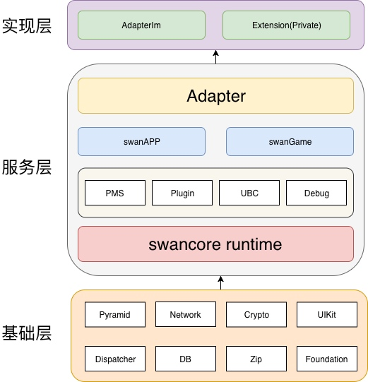

##小程序开源框架结构大体分三层：

 - 实现层
 - 服务层
 - 基础层

架构图如下：

##分层介绍（从下往上）

# 1. 基础层
小程序依赖的库，分外部开源库、手百内部基础库（对外开源）。

# 2. 服务层
mnp工程：小程序核心，对外开源，包含模块：runtime、下载服务PMS、功能plugin、日志、调试、小程序、小游戏、adapter等。

# 3. 实现层
mnpPyramid工程（需要宿主搭建）：adapter实现、宿主app的私有能力扩展。

