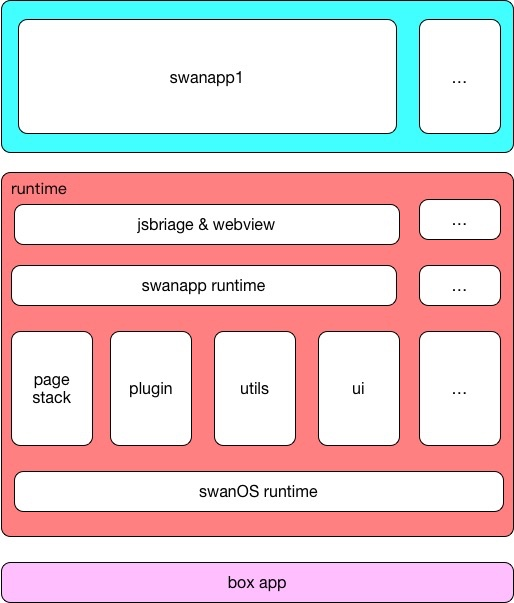
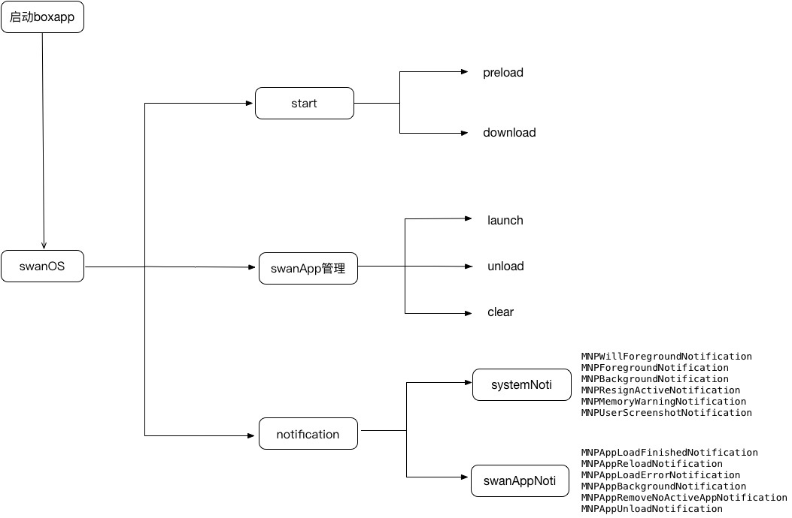

# 1. 小程序运行框架设计
## 1.1. 文档版本

|文档版本|修改日期|修改概述|
|:--|:--|:--|
|0.8|2018-12-19|初始版本|

## 1.2. 小程序架构图
基于小程序所在的运行时依赖于手百的程序环境，为了更好地降低小程序与手百主APP、小程序之间的耦合关系，小程序运行时分为swanOS runtime和swanapp runtime。小程序整体架构图：

 1. swanOS runtime负责维护所有小程序运行时的生命周期、小程序的对象池管理；
 2. swanapp runtime只负责维护自己小程序本身的一个生命周期；
 
-----

## 1.3. swanOS runtime启动顺序图

 start：负责swanCore的preload、downloader任务;
 swanApp管理：app的launch、unload、clear、appQueue操作；
 notification: 接收iOS系统通知、swanApp的通知事件；
 
## 1.4. swanapp runtime life-cycle

根据小程序在手百下运行的显隐状态分：frontgroundDisplay、backgroundDisplay；
小程序运行时的生命周期，分为5种状态：

 1. init：小程序处于初始化加载中状态，swanCore 加载，业务包下载、加载，可以在frontgroundDisplay、backgroundDisplay；
 2. active：小程序在前台时，已经加载完成，小程序在当队列中只有一个小程序处于active状态；
 3. half-active：小程序由active状态转为half-active状态，比如：播放一个后台音频任务；
 4. resign-active：当前小程序在frontground时，当前小程序被下一个小程序盖住，此时当前小程序由active状态转为resign-active状态；
 5. background：小程序退出导航栈时，由active状态转为background状态；