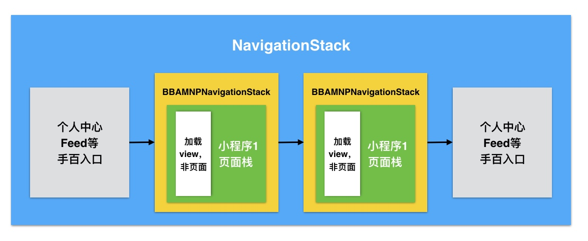

# 1. 小程序页面栈设计
## 1.1. 文档版本

|文档版本|修改日期|修改概述|
|:--|:--|:--|
|0.8|2018-12-19|初始版本|

## 1.2. 设计
  
因为手百整体框架用一个导航栈，要维持feed、搜索等框架的跳转逻辑（包括其他端能力跳转的框架），如果使用present方案设计，则必须销毁整个小程序，再进行跳转其他框架，方案存在设计漏洞。
	
 - 方案：外层沿用手百导航栈，跳转每个小程序用手百导航栈，每个小程序单独维护导航栈）
	



## 1.3. 生命周期
```sequence
运行时->页面栈: init 
运行时->页面栈: appActive（页面栈处于前台）
运行时->页面栈: appResign（页面栈处于后台）
Note right of 运行时:5分钟后小程序被销毁 | 缓存的小程序超过5个
运行时->页面栈: appUnload（页面栈卸载，只保留rootVC）
Note right of 运行时:再次回到前台
运行时->页面栈: appload（页面栈重新初始化）
运行时->页面栈: dealloc
```

```sequence
Note right of 运行时:手势返回 | 关闭小程序
页面栈->运行时: 通知告诉运行时   
```

## 1.4. 小程序调起新的小程序：

	