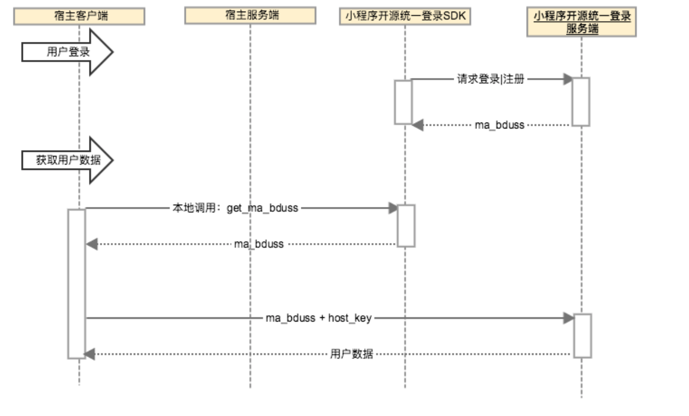

<!-- TOC -->

- [1. 开源联盟登录](#1-开源联盟登录)
    - [1.1. 文档版本](#11)
    - [1.2. 说明](#12)
    - [1.3. 流程](#13)
    - [1.4. 开发指南](#14)
        - [1.4.1. 相关协议](#141)
        - [1.4.2. 调用方式](#142)
    
  - [1.5. 备注](#15)

<!-- /TOC -->
##  1. 开源联盟登录
### 1.1 文档版本
|文档版本|修改日期|修改概述|
|:--|:--|:--|
|2.9.0|2019-08-09|联盟账号|

### 1.1 说明
小程序sdk提供开源联盟账号功能，解决各宿主app账号之间的互通关系；
针对非百度系宿主，在特定场景下，调起sdk提供的联盟账号登录页面，引导用户进行登录。

### 1.2 流程
目前开源联盟登录仅用于非百度系宿主的聚合支付场景，宿主使用开源联盟登录的流程如下：




### 1.3 开发指南
#### 1.3.1 相关协议

```
BBASMServiceProtocol

# pragma mark - UnionAccount

/**
 * @brief 宿主退出联盟登录
 */
+ (void)unionAccountLogOut;

/**
 * @brief 获取到maBduss
 * @return 登录成功的maBduss
 */
+ (NSString *)getUnionMabduss;

```   
#### 1.3.2 调用方式
1.退出联盟账号登录

 在需要退出联盟账号的场景下调用
 
 ```
  [Pyramid.bba_MNP unionAccountLogOut];
 ```
 2.获取用户信息
 
  （1）调用接口获取用户的maBduss
  
  ```
   [Pyramid.bba_MNP getUnionMabduss]
  ```
  
  （2）携带maBduss向小程序sdk侧服务端请求接口，获取用户相关信息，请求方式查看服务端文档"内部应用携带ma_bduss 换取用户信息"；
  
  
  
  
#### 1.5 备注
  
  注意：
  
  1.联盟账号登录目前仅用在非百度系宿主的聚合支付场景；聚合支付接入方式查看“聚合支付接入”。
  
      


