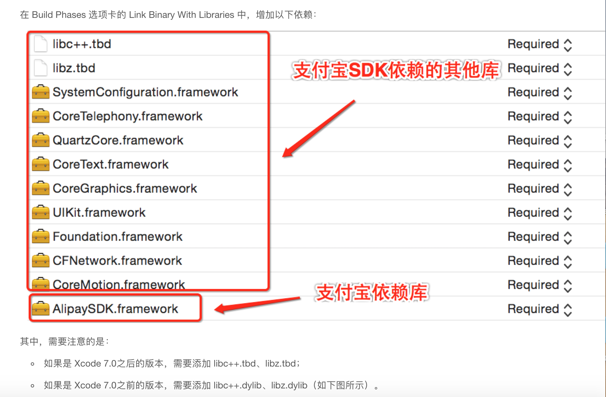
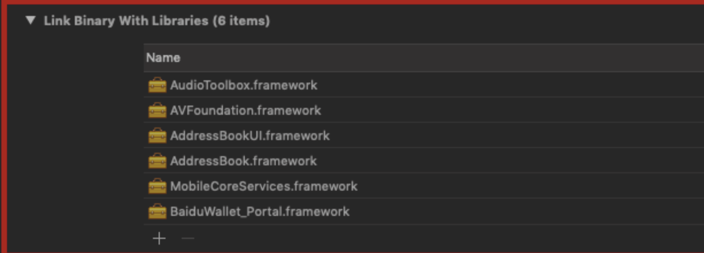
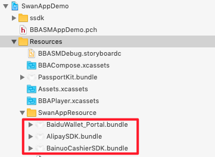
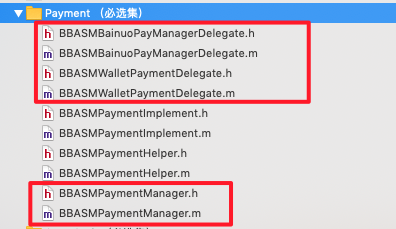
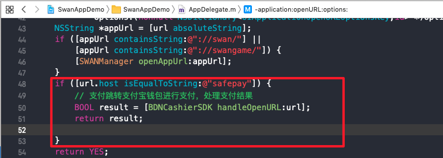

<!-- TOC -->

- [1. 聚合收银台支付](#1-聚合收银台支付)
    - [1.1. 文档版本](#11)
    - [1.2. 接入说明](#12)
       - [1.2.1. 概述](#121)
       - [1.2.2. 集成sdk](#122)
       - [1.2.3. 实现接口协议](#123)
        
  - [1.3. 备注](#13)

<!-- /TOC -->
##  1. 聚合收银台支付
### 1.1 文档版本
|文档版本|修改日期|修改概述|
|:--|:--|:--|
|2.9.0|2019-08-09|联盟账号|

### 1.2 接入说明
#### 1.2.1 概述
聚合收银台是聚合了度小满支付、支付宝支付、微信支付的能力，需要分别引入sdk，实现聚合支付能力；

#### 1.2.2 集成sdk
1.获取以下4个sdk集成到工程中

(1) 聚合收银台sdk:BainuoCashierSDK
直接从demo工程中获取，路径：`product-mnpproject/SwanAppServices/otherLib/Pay/BainuoCashierSDK.framework`

(2) 支付宝支付sdk:
[支付宝官网下载地址](https://docs.open.alipay.com/54/104509)

(3) 度小满支付sdk:
[度小满官网下载地址](https://b.baifubao.com/static/spcenter/fe-wallet-open-platform/entry/develop-document/#/download)

(4) 微信支付sdk:
[微信官网下载地址](https://pay.weixin.qq.com/wiki/doc/api/app/app.php?chapter=11_1)

示例：demo工程中准备好4个sdk，放入`product-mnpproject/SwanAppServices/otherLib/Pay`路径下；


2.增加sdk的依赖库，参考支付宝和度小满的官方文档

支付宝依赖库:



度小满依赖库：



3.引入sdk的资源文件到工程中

示例：




#### 1.2.3 实现接口协议
1.实现聚合支付端能力的协议(参考[支付](支付.md))

(1) 协议 `BBASMPaymentAdapterProtocol`

(2)接口：

```
/**
 * @brief 糯米聚合收银台
 *
 * @discussion 调起聚合收银台，小程序可以配置收银台的支付渠道。
 * @param params          调起参数，包含订单信息、宿主信息以及场景值等。宿主app不需要做额外处理，直接透传给收银台API即可
 * @param bannedChannels  收银台需要屏蔽的渠道列表，宿主app不需要做额外处理，直接透传给收银台API即可
 * @param completionBlock 支付回调，其中payResult需要宿主app通过kBDNCashierWalletPayResultPayDescsKey取出后直接透传给小程序框架
 */
+ (void)requestBainuoPolymerPaymentWithParams:(NSDictionary *)params
                               bannedChannels:(NSArray *)bannedChannels
                                   completion:(void (^)(BBASMPaymentStatus status, NSString *payResult))completionBlock;
```

(3)参考示例
  
  demo中：`BBASMPaymentImplement`
  
2.实现聚合收银台和度小满的相关协议

(1) 实现聚合收银台的协议`BDNCashierSDKDelegate`

参考demo工程：




(2) 注意`bdncashier_alipayScheme`的返回值需要修改为宿主宿主App注册在info.plist中的scheme，用于支付完成后返回宿主App。


(3)APPDelegate中需要增加对支付宝回调结果的处理




### 1.3 备注
注意：

1.目前聚合收银台支付中只对开源宿主提供度小满和支付宝支付的能力，但是微信支付sdk也需要集成到工程中；

2.度小满支付依赖百度账号，所以在进行度小满支付的时候，可能会产生两次登录行为；一次是在调起聚合收银台支付进行的联盟账号登录，一次是进行度小满支付的时候进行的百度账号登录。


      


