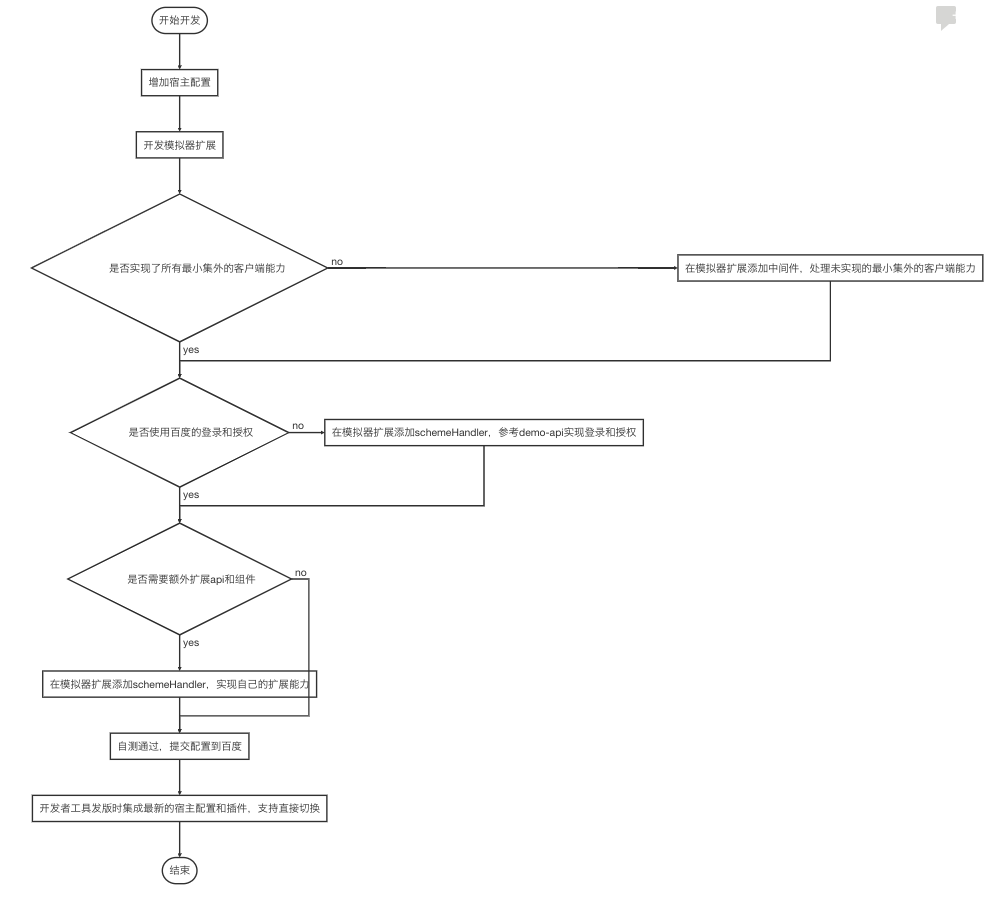

# 开发者工具宿主接入文档
##背景
开发者工具扩展提供宿主在开发者工具内的最小集、端能力的实现，小程序开发者在开发者工具内的宿主环境调试时，是必现要宿主方实现的功能。

## 快速开始

要实现一个新的APi,需要在开发者工具模拟器扩展中添加一个api的实现,同时在框架的 extensionJs 中添加一个新的api描述。下面简述如何快速添加一个api

- 安装2.2.4以上版本的开发者工具
- 下载文档内的demo目录代码
- 复制demo内的extensionJs/1.0.0 到 ~/.swan-cli/vendor/demo-program-extension 目录下
- 打开开发者工具
    - mac 系统在终端中使用下面的命令,
    `/Applications/百度开发者工具.app/Contents/MacOS/百度开发者工具 --host --console`
    - windows 系统在cmd中使用命令 `%USERPROFILE%\AppData\Local\Programs\swan-ide-gui\百度开发者工具.exe --host --console` ,
    也可以使用快捷方式,在后面添加 `--host --console` 参数来启动工具
- 打开一个小程序工程，在工具栏中打开宿主配置管理中心，选择加载本地宿主，打开demo/ide/demo目录，关闭宿主配置管理中心，切换成示例APP宿主
- 等待编译完成后,在调试器 console 中输入`swan.demo.demo({data:{test: 1},success:console.log})`,可以看到输出了api中返回的内容。

## 接入流程图
- 
## 详细说明 
   - [如何开发和调试](开发和调试.md)
   - [如何增加宿主配置](增加宿主配置.md)
   - [如何开发模拟器扩展](开发模拟器扩展.md)
     - [开发一个api扩展](api扩展.md)
     - [开发一个组件扩展](组件扩展.md)
   - [使用demo](demo.md)
 

