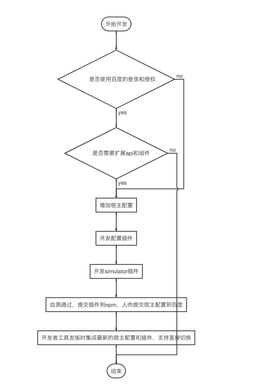

# 开发者工具宿主接入文档

##快速开始
- 安装百度提供的开发者工具安装包
- 打开百度开发者工具文件代码目录。
    mac系统文件位置`/Applications/百度开发者工具-beta.app/Contents/Resources/app`,
    windows系统文件位置`%USERPROFILE%\AppData\Roaming\百度开发者工具-beta\resources\app`
- 打开代码目录下extensions/demo-api/master.js文件  todo api没有实现schememap,这个还做不了,实现方式待确认。。。
- 修改schemeHandlers部分的代码,添加下面内容 
    
        schemeHandlers: {
            demo = context => async ({query: {success, complete, fail}}) => {
                context.utils.execute(success, 0, 'success', {status: '0', message: 'success'});
            };
        }
- 打开一个小程序工程,点击工具栏切换宿主按钮,切换到demo宿主
- 重新打开工程,等待编译完成后,在调试器console中输入`swan.Demo.demo({success:console.log})`,可以看到输出了api中返回的内容。

- 接入流程图
- 详细说明 
    - [如何开发和调试](开发和调试.md)
    - [如何增加宿主配置](增加宿主配置.md)
    - [如何开发配置插件](开发配置插件.md)
    - [如何扩展api和组件](扩展api和组件.md)

