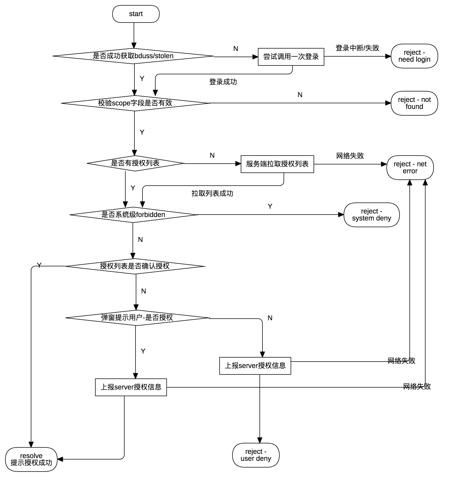

# 授权端能力
> 参考 [授权流程说明](https://smartprogram.baidu.com/docs/develop/api/open_log/#%E6%8E%88%E6%9D%83%E6%B5%81%E7%A8%8B%E8%AF%B4%E6%98%8E/)
> 参考 [授权端能力](https://smartprogram.baidu.com/docs/develop/api/open_authorize/#authorize/)

## 概述
本章节包含开发者工具中授权以及相关端能力的设计说明，具体包括如下端能力的实现：
- [授权端能力](https://smartprogram.baidu.com/docs/develop/api/open_authorize/#authorize/)

以及以下内部暴露方法：
- 间接设置授权 （open-setting 无需弹窗提示用户）
- 间接设置授权 （其它端能力等 仍需弹窗提示用户）
- 清除授权（开发者工具顶部操作按钮 > 清缓存 > 清除授权缓存/全部清除）
- 获取授权信息 （get-setting open-setting）

## 调用出入参数

### 传入参数
#### 端能力API
（[授权端能力](https://smartprogram.baidu.com/docs/develop/api/open_authorize/#authorize/)）：符合端能力调用的统一参数，包括context、query
#### 内部暴露方法
- 间接设置授权 （open-setting 无需弹窗提示用户）
调用方式`event.send('simulator-set-authorize', {scope: 'scope', permit: true})`

| 参数 | 类型 | 说明 |
|--|--|--|
| scope | string | 授权scope |
| permit | boolean | 开启/关闭授权 |

- 间接设置授权 （其它端能力等 仍需弹窗提示用户）
调用方式 `context.simulator.authorize('scope')`

| 参数 | 类型 | 说明 |
|--|--|--|
| scope | string | 授权scope |

- 获取授权信息 （get-setting open-setting）
调用方式 `event.send('simulator-get-authorize-list-ori')`

- 清除授权，暂无其它方调用
调用方式 `event.send('clear-auth')`

### scope列表
> 参考[授权端能力](https://smartprogram.baidu.com/docs/develop/api/open_authorize/#authorize/) - scope列表 章节

| scope id (开发者工具内部) | 说明 |
|--|--|
| mobile | 绑定的手机号码 |
| snsapi_userinfo | 用户信息 |
| mapp_location | 地理位置 |
| mapp_images | 保存到相册 |
| mapp_camera | 摄像头 |
| mapp_record | 录音功能 |
| mapp_choose_invoice | 发票抬头 |
| mapp_choose_address | 收货地址 |

### 错误码说明
| 状态码 status | 说明 message |
|--|--|
| 0 | 登录成功，同时返回授权code |
| 99999 | 网络错误 network error |
| 10004 | 用户未登录 user not login |
| 10007 | 清检查网络状况和超时设置 request_timeout |
| 10007 | 清检查网络状况和超时设置 request_timeout |
| -1 | appkey异常 请登录开发者工具，并检查是否正确配置appid(project.swan.json) |

### 端能力API/内部暴露方法的返回参数
端能力通过回调（1级/2级）形式返回参数，其它内部暴露方法通过Promise方式返回，数据格式均遵从以下通用数据结构。

通用结构
| 参数 | 类型 | 说明 |
|--|--|--|
| status | string | 状态码 详见`错误码说明` |
| message | string | 状态说明 |
| data | object | 数据（可选参数）|

@todo 说明参数

## 文件说明
```
extensions/simulator-swan-api/src
├── components
│   └── show-modal
│       └── index.js                    // modal UI组件 间接依赖
├── index.js
└── webview
    ├── scheme
    │   ├── index.js
    │   ├── opendata
    │   │   ├── authorize
    │   │   │   └── index.js            // 授权端能力调用入口文件
    │   │   ├── index.js
    │   │   ├── setting
    │   │       ├── get-setting.js      // 授权调用方： get-setting
    │   │       ├── index.js
    │   │       └── open-setting.js     // 授权调用方： open-setting
    ├── utils
        ├── authorize
        │   ├── api.js                  // 授权网络请求相关
        │   ├── constant.js             // 授权相关常量声明
        │   └── index.js                // 授权主体逻辑
        └── index.js
```

## 逻辑概述
开发者工具授权端能力实现逻辑如下流程图：



<!-- 按照设计流程图，将逻辑分块，以promise串联， -->
- 授权方法，详见上图
    <!-- - 首先通过登录模块间接获取bduss/stoken
        - 获取失败，尝试调用一次登录，如成功则继续向下**获取成功**流程，失败则返回对应提示
        - 获取成功，继续执行(isScopeAllow)
            - 校验scope是否合法，不合法则返回对应提示
                - 如局部变量中存在 -->
> 调用方
>   - [授权端能力](https://smartprogram.baidu.com/docs/develop/api/open_authorize/#authorize/)
>   - open-setting面板，相比于端能力，调用区别在于：通过传入的`permit`参数直接开关授权，无需弹窗提示用户
>   - 其它端能力等内部使用方：将授权方法挂载于master和slave的context中，供其它调用方使用

- 清除授权
    - 发送清除授权的网络请求
    - 清空本地授权信息变量

- 获取授权列表
    - 如有授权信息的局部变量则直接返回，否则尝试服务端拉取
> 调用方
>   - open-setting 面板
>   - get-setting 端能力