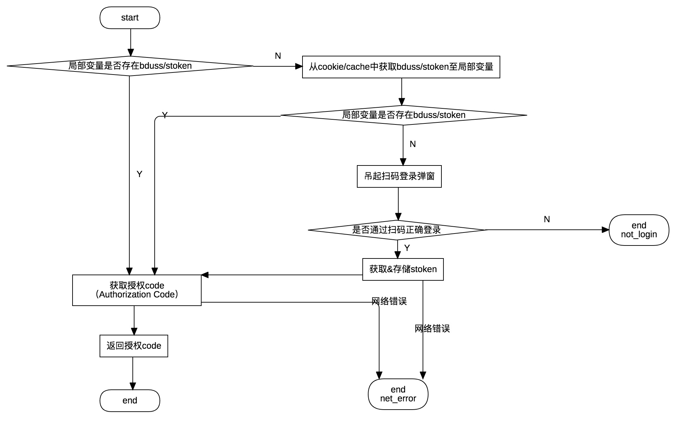

# 登录端能力
> 参考 [智能小程序-开放接口-登录](https://smartprogram.baidu.com/docs/develop/api/open_log/)

## 概述
本章节包含开发者工具中登录以及相关端能力的设计说明，具体包括如下端能力的实现：
- [登录端能力-login](https://smartprogram.baidu.com/docs/develop/api/open_log/#login/)
- [同步获取登录状态-isLoginSync](https://smartprogram.baidu.com/docs/develop/api/open_log/#isLoginSync/)
- [检测当前用户登录态是否有效-checkSession](https://smartprogram.baidu.com/docs/develop/api/open_log/#checkSession/)

以及以下内部暴露方法：
- 清除登录（开发者工具顶部操作按钮 > 清缓存 > 清除登录状态/全部清除）
- 获取bduss/stoken

## 调用出入参数

### 传入参数
- 3个端能力API：符合端能力调用的统一参数，包括context、query
- 内部暴露方法：
    - 清除登录，无需入参，调用方法 `event.send('clear-login')`
    - 获取bduss/stoken，无需入参，调用方法 `event.send('get-simulator-bduss-stoken')`

### 错误码说明
| 状态码 status | 说明 message |
|--|--|
| 0 | 登录成功，同时返回授权code |
| 99999 | 网络错误 network error |
| 10004 | 用户未登录 user not login |
| 10007 | 清检查网络状况和超时设置 request_timeout |
| 10007 | 清检查网络状况和超时设置 request_timeout |
| -1 | appkey异常 请登录开发者工具，并检查是否正确配置appid(project.swan.json) |

### 端能力API/内部暴露方法的返回参数
端能力通过回调（1级/2级）形式返回参数，其它内部暴露方法通过Promise方式返回，数据格式均遵从以下通用数据结构。

通用结构
| 参数 | 类型 | 说明 |
|--|--|--|
| status | string | 状态码 详见`错误码说明` |
| message | string | 状态说明 |
| data | object | 数据（可选参数） |

下面对各个API/方法返回的data参数（状态码为0，正常返回的情况下）进行说明：
- [同步获取登录状态-isLoginSync](https://smartprogram.baidu.com/docs/develop/api/open_log/#isLoginSync/)、[检测当前用户登录态是否有效-checkSession](https://smartprogram.baidu.com/docs/develop/api/open_log/#checkSession/)无data返回

- [登录端能力-login](https://smartprogram.baidu.com/docs/develop/api/open_log/#login/)

|参数  |类型|说明 |
|---- | ---- |---- |
|code|String|用户登录凭证（有效期五分钟）,开发者需要在开发者服务器后台调用 api，使用 code 换取 session_key 等信息。|

- 获取bduss/stoken

|参数  |类型|说明 |
|---- | ---- |---- |
|bduss|String||
|stoken|String||

## 文件说明
```
extensions/simulator-swan-api/src
├── components
│   └── login
│       ├── index.css
│       ├── index.js                // 登录UI san组件
│       └── preload.js              // preload脚本 用于监听登录webview的成功事件
├── events
│   └── login.js                    // 登录功能主体逻辑
├── index.js                        // 登录相关事件监听入口 调用events/login.js
└── webview
    ├── master
    │   └── index.js
    ├── middlewares
    │   └── index.js
    ├── scheme
    │   ├── opendata
    │   │   ├── index.js
    │   │   └── login
    │   │       └── index.js        // 登录端能力调用处理入口 通过事件调用src/index.js
    └── slave
        └── index.js
```

## 逻辑概述
<!-- 登录、授权的主体逻辑是按照以下流程图设计： -->
<!--  -->

开发者工具登录端能力实现逻辑如下流程图：


### 端能力API
- [登录端能力-login](https://smartprogram.baidu.com/docs/develop/api/open_log/#login/)
    - 被调用时，首先校验登录相关的bduss(存储于cookie)/stoken(存储于cache)是否存在。bduss、stoken是校验登录状况的两个关键字段，任意字段缺失则认为登录失效。
        - 如存在，则认为登录正常，然后通过接口获取授权code（Authorization Code），根据对应网络请求的结果并将其返回
        - 如不存在，则认为未登录，则弹出登录UI组件（此处是基于san实现的一个简单的二维码扫码弹层）,同时触发小程序生命周期变为`onHide`。此处实现为在dom中添加一个webview，用于加载登录页，并通过preload将自定义脚本加载进去，用于监听此页面的登录是否成功。如登录成功，则会正确命中cookie。
            - 如开发者正常扫码登录，则通过接口获取stoken，然后通过接口获取授权code（Authorization Code），并将结果返回，同时将小程序生命周期变为`onShow`
            - 如未正常登录，如点击空白区域关闭了登录框，则根据具体情景返回结果
> 此流程中某些流程可能会被中断掉，则需根据具体情景返回错误结果，详见`调用出入参数 > 错误码说明`

- [同步获取登录状态-isLoginSync](https://smartprogram.baidu.com/docs/develop/api/open_log/#isLoginSync/)
    - 因为整个登录主体逻辑是由各种异步函数串行构成，所以要同步获取登录状态，必须将维护一个可同步获取的登录状态值
    - 状态的维护：内部暴露一个维护登录状态的函数（通过函数调用/广播形式调用），将登录状态维护在cache中，此函数的触发时机：每次模拟器重新渲染、登录状态显性变化
    - 状态的获取：调用isLoginSync时，通过同步（`context.cache.getSync`）方式获取cache中的登录状态，并将其返回

- [检测当前用户登录态是否有效-checkSession](https://smartprogram.baidu.com/docs/develop/api/open_log/#checkSession/)
    - 尝试获取bduss/stoken
        - 如有缺失，则返回登录异常
        - 如字段正常，则调用openapi对应接口，根据接口返回值返回对应结果

### 内部暴露方法（通过事件广播形式调用）

- 清除登录（开发者工具顶部操作按钮 > 清缓存 > 清除登录状态/全部清除）
    - 清除cookie中的buss，清除cache中的stoken
    - 清除相关局部变量

- 获取bduss/stoken 事件名`get-simulator-bduss-stoken`
    - 将bduss/stoken相关数据的维护与管理集中于登录模块中，获取bduss/stoken亦是如此
