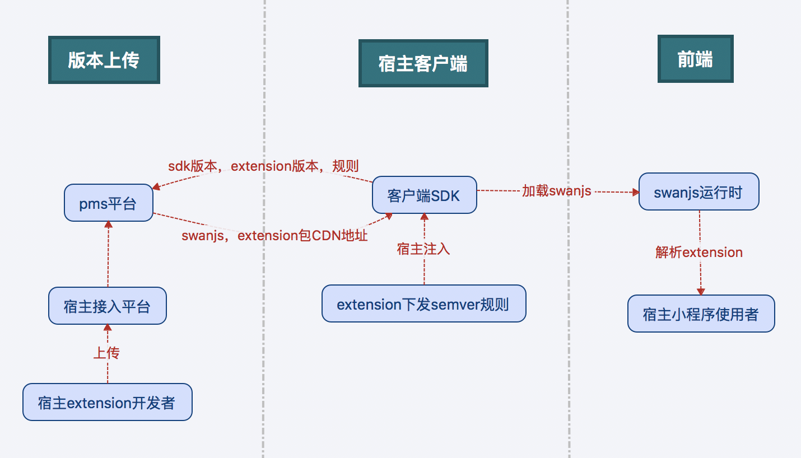

# 扩展 -- 下发&加载机制
### 版本对应关系
#### 3种版本概念

开源后总共有3种版本概念需要关注：

| 版本名称 | 版本号规则 | 例子 |
|:------------- |:---------------|:-------------|
|swan-native版本(SDK版本)|3位：A.B.C|1.2.3|
|swan.js版本(framework)|3位：(A+2).(B*10 + C).(X)|3.23.1|
|extension.js版本|3位：D.E.F|1.1.1|

#### 版本间关系

1. swan.js版本与SDK相关，维护在百度侧，无需宿主关注
2. extension与当前宿主客户端关系，由宿主侧维护 **extension_rule** 字段，由宿主将semver表达式传给SDK，SDK发给PMS，PMS找出符合此版本表达式的最大extension.js版本，并下发，如：'^1.1.2'

##整体流程

##详细流程：

