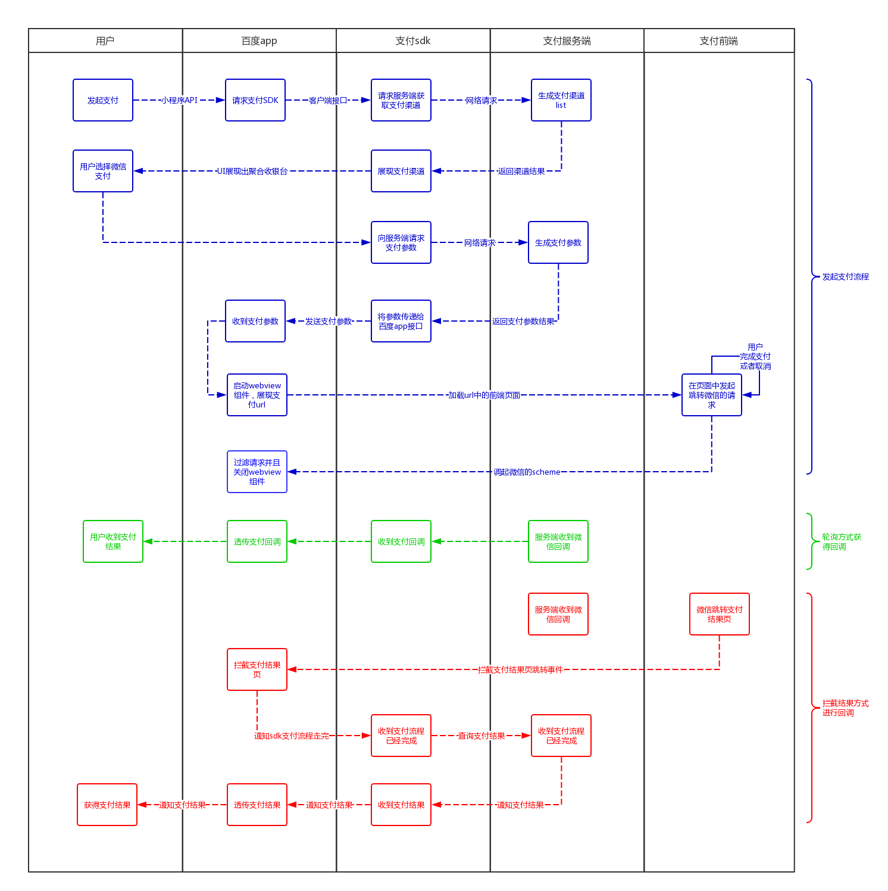

### 整体流程

>整体流程请参考上图

#### 1、服务端需要带给支付sdk的参数
>用户发起微信支付以后，进行聚合支付的正常流程，当选择微信H5支付的时候，服务端同学需要带下来以下字段给支付sdk：

| 参数名 | 类型 | 必填 |备注|
| ------ | ------ | ------ | ------ |
| prepayid | string | 是 |https://pay.weixin.qq.com/wiki/doc/api/H5.php?chapter=9_20 |
| url | string | 是|支付请求的地址（支付前端的url地址）|
| extra | Object | 是 | 需要填入的额外信息

>extra字段参数：

| 参数名 |  必填 |备注|
| ------ |  ------ | ------ |
| mweb_url |  否 |https://pay.weixin.qq.com/wiki/doc/api/H5.php?chapter=9_20 |
| custome_key |  否 | 其他的自定义键值，cp可以根据需要增加其他自己认为需要的键名和键值|

#### 2、服务端需要带给前端的参数
> https://pay.weixin.qq.com/wiki/doc/api/H5.php?chapter=9_20&index=1

### 回调方式问题

>目前回调方式有轮询和触发两种方式，需要调研一下使用那一种

### 退款查询等接口

> 需要服务端同学遵循微信文档进行对应处理
        
