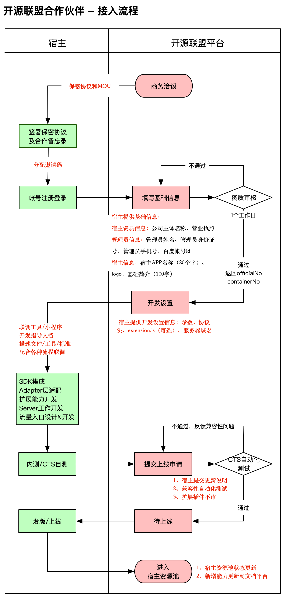

# 整体入驻说明

> 本节为您入驻需要进行的准备及操作：开源联盟合同签署、注册&创建宿主、开发集成、CTS测试、发布上线。

各操作关系如下图：

## 1. 开源联盟合同签署

开源联盟合同的签署首先需要宿主完成协议签订，协议包括：
 - MOU：开源联盟协议
 - NDA：开源联盟保密协议
 - 战略合作协议：开源联盟的战略合作

在宿主完成协议签订后，百度智能小程序根据MOU&NDA，百度为宿主开通Github权限。

## 2. 注册并创建宿主

前期采用线下邀请制的方式，发送至邮箱： smartprogram_bd@baidu.com，即可完成在开源联盟平台的注册和创建。

邮件模板：

	【标题】：【宿主入驻】XXX平台宿主入驻申请 
	【邮件内容】：需包含以下信息
	- 宿主资质信息：公司主体名称、营业执照;
	- 管理员信息：管理员姓名、管理员身份证号、管理员手机号、百度帐号 id;
	- 宿主信息：宿主 APP 名称（ 20 个字）、logo、基础简介（ 100 个字）。

在收到您的邮件后，我们将在 24 小时内为您反馈 officialNo 和 containerNo 用于宿主开发。

#### officialNo、containerNo 两个 id 用途：

- 用于SDK日志上传&小程序日志下载：officialNo、containerNo ；
- SDK 设置 officialNo、 containerNo ；
- 发布扩展包，用于区分宿主扩展包时，提交 containerNo ；
- 与 Bserver 交互的部分，都需要 containerNo 。

## 3. 开发集成 

#### 在开发集成构成中，需要您进行如下行为：
 - 服务域名设置：提供宿主服务域名；
 - 开发规范信息：[UA规则](规范说明/UA规则.md)、[调起协议](规范说明/调起协议.md)、[分享](规范说明/分享.md) ；
 - 框架API、组件扩展 extension 前端接入 ；
 - 开发：完成SDK集成、Adapter适配、扩展能力开发、Server开发工作客户端swan-native接入；
 
	> 客户端第三方依赖库 [iOS](客户端swan-native接入/iOS/简介/小程序依赖三方库.md)、[Android](客户端swan-native接入/Android/第三方依赖库说明.md)  

 - 其他 (此处需联系百度方支持 yangbo21@baidu.com)：

	 * 开通二维码访问时server中转白名单；
	 * 申请from（打开小程序的场景值）；
	 * extension 包发布到百度 CDN（目前手动给到百度，后续在开源联盟平台上传）。

#### 在此过程中，我们将为您提供如下服务：
 - 在开发过程中提供技术支持；
 - 完成二维码扫码流程适配；
 - 对接包审核流程。

### 流量开发(后续支持)

在开发过程中，除集成开发外，还有流量开发，宿主可以对流量入口进行设计、开发，能够支持分发小程序。

## 4. CTS 测试

小程序 CTS是基于百度自研发的自动化测试框架和case编写完成的。大部分CTS测试集是自动执行用例，自动收集和汇总测试结果。宿主在本地执行后将App包和认证通过的测试报告上传即可。

## 5. 发布上线（不同宿主不同）
宿主需通过CTS测试后，进行版本的发布上线。

#### 流量分发(功能暂无)管理过程
 - 宿主提供流量入口的介绍、截图、API文档；
 - 百度智能小程序 将宿主流量说明上线至开发者开发文档。

